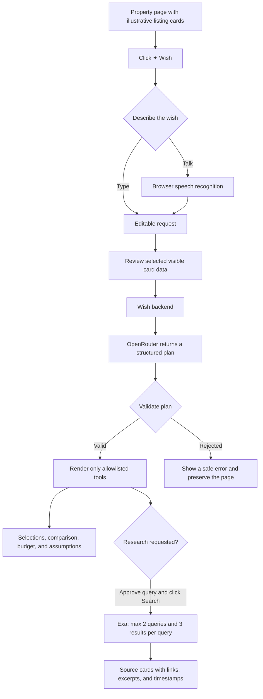

# Wish: working idea, flow, and how to use it

## The idea

Wish makes a property page feel adaptable without changing the site itself. A renter or buyer clicks **✦ Wish**, describes the help they want in plain language or by voice, and receives a small set of useful, safe tools over the listings already visible on that page.

For example: *“Compare these homes side by side and show which are under AED 150,000 a year.”* Wish can turn that request into checkboxes, a comparison view, a budget filter, and transparent rent assumptions. It is a prototype designed around a single reliable property-card format rather than a universal web scraper.

The included Harbor & Grove page is fictional and clearly labelled. It exists to demonstrate the interaction before Wish is adapted to a real supported listing page.

## End-to-end flow



### What happens at each point

| Stage | What Wish does | What stays under the user's control |
| --- | --- | --- |
| Describe | Captures a typed request or an editable speech transcript. | Voice starts only after the user presses the voice button. |
| Review | Shows the compact, visible listing data that would be used. | Nothing is sent to an external model until the user reviews and submits it. |
| Plan | Asks the configured model for strict JSON describing allowed components. | A validator checks IDs, component types, limits, and fields before any UI changes. |
| Use tools | Adds comparison, budget, and assumption controls to the page. | The original page and visible listings remain the source of truth. |
| Research | Proposes concise searches when research is requested. | Each external search needs an explicit approval click. |

## How to use Wish

### Option A — use the built-in standalone preview

This is the fastest way to see the full Wish-button experience. It does **not** require loading the browser extension.

1. In this project folder, run `npm start`.
2. Open [http://localhost:8787](http://localhost:8787).
3. Click the floating **✦ Wish** button at the lower-right of the page.
4. Type your request, or choose **Talk to Wish** and allow the browser microphone prompt only if you want speech-to-text.
5. Review the clearly labelled fictional listings and check the consent box.
6. Select **Create my Wish**. The preview returns a plan and enables comparison controls on the demo cards.

The prompt is always editable. If the browser does not support speech recognition or microphone access is declined, type the request instead.

### Option B — load the Chrome extension

1. Start the backend with `npm start`.
2. In Chrome, visit `chrome://extensions` and enable **Developer mode**.
3. Choose **Load unpacked** and select this project's `extension` folder.
4. Open the Harbor & Grove demo at [http://localhost:8787](http://localhost:8787), or a property page using the supported card format.
5. Click the Wish extension icon in Chrome's toolbar. Wish injects its compact panel into the current page.
6. Enter a request or select **Describe by voice**. Review the generated transcript, then continue with the page tools.

After changing extension files, click Chrome's reload icon for the extension and reload the target page. The extension was built for cards with visible title, currency, price, and monthly or annual rental period; unsupported layouts show an explanation instead of guessing.

## Suggested demo prompts

Try one request at a time:

1. `Compare these homes side by side.`
2. `Add an AED 150,000 annual budget and let me enter deposit and agency fees.`
3. `Research this neighborhood and show me sources.`

The last request follows the research-approval path. Wish proposes bounded queries first; it does not search until the user presses the dedicated search action.

## Setup and provider keys

Wish keeps provider credentials in the local `.env` file, never in the extension bundle or repository.

```powershell
Copy-Item .env.example .env
notepad .env
npm start
```

Add `OPENROUTER_API_KEY` and a separately selected `OPENROUTER_MODEL` to `.env`. `EXA_API_KEY` is optional and is required only for the research step. Restart the backend after changing `.env`.

Do not paste keys into source files, commit `.env`, or add them to the extension. The backend makes provider calls so keys remain local. The model endpoint exposes no credentials, and verification endpoints return no credentials.

To run the bounded provider checks after setup:

```powershell
Invoke-RestMethod -Method Post http://127.0.0.1:8787/api/verify/openrouter
Invoke-RestMethod -Method Post http://127.0.0.1:8787/api/verify/exa
```

## Guardrails and privacy

- Wish does not book homes, make payments, alter accounts, send messages, or execute model-provided JavaScript.
- The model may select only components from Wish's allowlist. Server-side validation rejects unexpected IDs, fields, or UI types.
- The request uses only the compact card data the user reviewed. The page's raw HTML and microphone audio are not sent to the Wish backend.
- Speech recognition is browser-provided and may use the browser's speech service. It begins only from a user click. See [MDN's SpeechRecognition reference](https://developer.mozilla.org/en-US/docs/Web/API/SpeechRecognition) for browser behaviour and availability.
- Exa receives only approved research queries. Wish limits research to two queries and three results per query, with displayed source links and retrieval times.
- CSV exports include provenance so a recipient can distinguish listing data from the user's assumptions.

## Architecture at a glance

| Part | Responsibility |
| --- | --- |
| `demo/wish-preview.js` | Standalone floating Wish button and type/voice interaction for the fictional demo. |
| `extension/content.js` | Extracts supported listing cards and owns the injected, isolated page UI. |
| `extension/background.js` | Manifest V3 messaging and localhost backend requests; it contains no provider keys. |
| `backend/server.mjs` | Serves the demo, proxies bounded OpenRouter/Exa requests, and exposes verification endpoints. |
| `backend/core.mjs` | Validates listing records and structured plans before the interface applies anything. |

## Validation and known limits

Run the local checks with:

```powershell
npm run check
npm test
```

The standalone button was manually opened and inspected in the local demo. The provider configuration was exercised with bounded, schema-valid requests. Loading the toolbar extension and accepting a microphone prompt are deliberately manual browser actions: they require the user's local Chrome installation and explicit permission.

Wish currently supports a narrow listing-card adapter. It will not reliably interpret every real-estate website, convert different currencies, or invent missing charges. The partial-upfront estimate is limited to the first equal rent installment, refundable deposit, and a fixed agency fee supplied by the user; anything unlisted remains unknown.

## Quick troubleshooting

| If you see this | Try this |
| --- | --- |
| No floating standalone button | Confirm `npm start` is running, then reload [http://localhost:8787](http://localhost:8787). |
| No extension panel | Reload the extension at `chrome://extensions`, reload the property page, and click its toolbar icon. |
| Voice is unavailable | Use a supported browser, allow microphone access only if desired, or type the request. |
| Offline/demo result | Configure OpenRouter in local `.env`, restart the server, then use the verification endpoint. |
| Research is unavailable | Add a local `EXA_API_KEY`, restart, and explicitly approve a proposed query. |
| A real page is unsupported | Use the Harbor & Grove demo or adapt the property-card extractor for that page's stable visible fields. |

